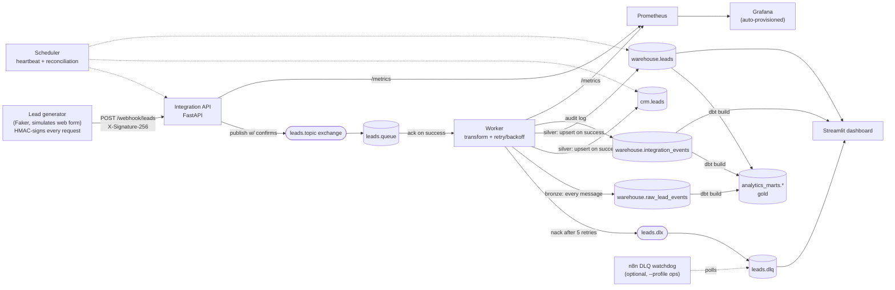

# Lead Sync Integration Pipeline

**An end-to-end integration pipeline that syncs web-form leads into a CRM and a
data warehouse in near real time — without duplicating a single record, even
under retries, replayed webhooks, and a message broker that quarantines
poison messages instead of losing or looping on them.**

Sales and marketing teams lose trust in their CRM when the same lead shows up
twice, or when a flaky integration silently drops a submission. This project
is a self-contained, runnable demo of the integration patterns an Integration
Engineer actually reaches for in production: signed webhooks, a real message
broker with dead-lettering, retries with backoff, idempotent upserts,
Prometheus/Grafana observability, and a SQL mart layer on top.


## Business scenario

```
Web form (Typeform-like) --signed webhook--> Integration API --AMQP--> RabbitMQ --> Worker --> CRM (mock)
                                                                                         \--> Warehouse --> dbt marts --> Dashboard
```

- **Source**: a simulated web-form submission (`src/generator/generate_leads.py`
  posts realistic fake leads, generated with Faker, to the ingestion API,
  HMAC-signing each request the way a real upstream system would).
- **Integration layer**: a FastAPI service verifies the webhook signature and
  the payload, then publishes to RabbitMQ (with publisher confirms) so the
  form never waits on a slow downstream system.
- **Processing**: a worker consumes the queue, transforms the payload, and
  upserts it into a mock CRM table and a warehouse table — with retries and
  exponential backoff around a deliberately flaky "CRM API" call, and
  dead-lettering once retries are exhausted.
- **Destination**: Postgres, layered bronze (`warehouse.raw_lead_events`) →
  silver (`crm.leads` / `warehouse.leads`) → gold (`analytics_marts.*`, built
  by dbt).
- **Consumption**: a Streamlit dashboard (business view: leads synced, trends,
  DLQ depth, recent events) and a Grafana dashboard (operational view: rates,
  retry volume, p95 processing latency), both auto-provisioned.

See [ARCHITECTURE.md](./ARCHITECTURE.md) for the reasoning behind every one of
these choices and the trade-offs.

## Architecture



## Tech stack

| Layer | Choice | Why |
|---|---|---|
| Language | Python 3.12 | shared across all services, easy to review |
| API | FastAPI | async, typed, auto docs at `/docs` |
| Message broker | RabbitMQ (topic exchange + DLQ) | real topology + dead-lettering, not app-level bookkeeping on a list |
| Webhook auth | HMAC-SHA256 signatures | the Stripe/HubSpot/Shopify pattern — verifies the body, not just a shared secret |
| Database | Postgres (crm / warehouse / analytics_marts schemas) | one free, local engine instead of several |
| Transformation | dbt (optional, `--profile dbt`) | SQL-tested bronze → silver → gold mart layer |
| Orchestration | APScheduler (custom, documented) | pipeline is streaming, not a batch DAG — see ARCHITECTURE.md |
| Ops workflow | n8n (optional, `--profile ops`) | low-code DLQ-watchdog layer, the pattern integration teams use for alerting outside the codebase |
| Observability | Prometheus + Grafana (auto-provisioned) + structured JSON logs | operational metrics, not just a business dashboard |
| Dashboard | Streamlit | business-facing view: leads synced, trends, DLQ depth |
| Retries | tenacity (exponential backoff) | demonstrates resilience to a flaky CRM |
| Containerization | Docker + docker-compose | `docker-compose up` and the core stack runs |
| CI | GitHub Actions | ruff + black + pytest + docker build + a real end-to-end smoke test |

## Reliability features

- **Idempotency**: `UNIQUE (external_id)` + upsert on both the CRM and
  warehouse tables. Replaying a webhook or redelivering a message never
  creates a duplicate.
- **Retries with backoff, then dead-letter**: the CRM write is wrapped in
  `tenacity` with exponential backoff (capped at 5 attempts); once exhausted,
  the message is nacked and RabbitMQ routes it to `leads.dlq` instead of
  retrying forever or dropping it. A simulated failure rate
  (`CRM_FAILURE_RATE`) makes this observable, not theoretical.
- **Signed webhooks**: `X-Signature-256` is an HMAC-SHA256 over the raw body,
  checked with a timing-safe comparison — catches tampering, not just missing
  credentials.
- **Structured logs**: every service logs JSON (`{"ts", "level", "service",
  "message", ...}`), ready to ship to an observability stack (Datadog, ELK,
  CloudWatch).
- **Metrics**: `/metrics` on the API and worker (Prometheus format) — lead
  throughput, rejection reasons, retry volume, dead-letter rate, p95
  processing latency.
- **Audit trail**: every processing outcome (success, duplicate replay,
  dead-lettered) is written to `warehouse.integration_events`, which backs
  the dashboard's "recent events/errors" panel.
- **Bronze layer**: `warehouse.raw_lead_events` logs every message verbatim
  before any transform, so even dead-lettered leads can be attributed to a
  source in analytics.

## Running it locally

Requirements: Docker and Docker Compose. Nothing else.

```bash
git clone <this-repo-url> lead-sync-integration-pipeline
cd lead-sync-integration-pipeline
cp .env.example .env
docker-compose up --build
```

That starts the core stack: Postgres, RabbitMQ, the API, worker, scheduler,
Streamlit dashboard, Prometheus, and Grafana.

Then, once it's up:

```bash
# generate ~300 fake leads, replaying ~10% of them to prove idempotency
pip install -r requirements.txt   # or just: pip install requests faker
python -m src.generator.generate_leads --count 300 --duplicate-rate 0.1
```

| Service | URL |
|---|---|
| Streamlit dashboard | http://localhost:8501 |
| API docs (Swagger) | http://localhost:8000/docs |
| Health check | http://localhost:8000/health |
| RabbitMQ management UI | http://localhost:15672 (user/pass: `integration` / `integration`) |
| Grafana (auto-provisioned dashboard) | http://localhost:3000 (anonymous viewer access) |
| Prometheus | http://localhost:9090 |

Optional layers, each gated behind a [compose profile](https://docs.docker.com/compose/how-tos/profiles/)
so the core stack stays fast and doesn't require them:

```bash
# low-code ops workflow that polls the DLQ (import orchestration/n8n/lead-ops-alerts.json manually once it's up)
docker compose --profile ops up n8n   # http://localhost:5678

# SQL mart layer on top of the warehouse (one-shot, not a long-running service)
docker compose --profile dbt run --rm dbt build
```

Manual signed webhook call:

```bash
python3 - <<'PY'
import hashlib, hmac, json, urllib.request

secret = b"dev-local-signing-secret"  # must match WEBHOOK_SIGNING_SECRET in .env
body = json.dumps({
    "external_id": "demo-1",
    "full_name": "Ada Lovelace",
    "email": "ada@example.com",
    "company": "Analytical Engines Inc",
    "source": "webform",
}).encode()
signature = "sha256=" + hmac.new(secret, body, hashlib.sha256).hexdigest()
req = urllib.request.Request(
    "http://localhost:8000/webhook/leads",
    data=body,
    headers={"Content-Type": "application/json", "X-Signature-256": signature},
    method="POST",
)
print(urllib.request.urlopen(req, timeout=5).status)
PY
```

Replay the same `external_id` and check the dashboard's "Duplicate replays
blocked" metric — no duplicate row is created. Want to see the DLQ in action?
Set `CRM_FAILURE_RATE=1.0` in `.env`, restart the worker, and send a lead —
it'll show up in the dashboard's DLQ warning banner and in
http://localhost:15672/#/queues/%2F/leads.dlq.

## Project structure

```
integration1/
├── src/
│   ├── api/              # FastAPI ingestion webhook (HMAC auth, health, publish)
│   ├── worker/            # RabbitMQ consumer: transform, retry/backoff, DLQ, CRM + warehouse upsert
│   ├── generator/         # fake lead generator (simulates the web form, signs requests)
│   └── common/            # shared config, structured logging, db, broker topology, metrics
├── orchestration/
│   ├── scheduler.py        # APScheduler heartbeat + reconciliation job
│   └── n8n/                # optional low-code DLQ-watchdog workflow (--profile ops)
├── dbt/                    # optional SQL mart layer: bronze -> silver -> gold (--profile dbt)
├── observability/          # Prometheus config + auto-provisioned Grafana dashboard
├── dashboard/               # Streamlit app
├── db/init.sql              # Postgres schema (crm / warehouse)
├── tests/                   # pytest: transform logic + API endpoint behavior
├── docs/                    # screenshots / demo GIF
├── docker-compose.yml
├── .env.example
├── ARCHITECTURE.md          # design decisions and trade-offs
└── .github/workflows/ci.yml # lint + tests + docker build + end-to-end smoke test
```

## Tests and CI

```bash
pip install -r requirements-dev.txt
ruff check .
black --check .
pytest -v
```

GitHub Actions runs, on every push: lint + format-check + unit tests, a Docker
build of every service, and an **end-to-end smoke test** that boots the real
stack, sends an HMAC-signed webhook over HTTP, waits for the worker to land it
in `warehouse.leads`, and runs the dbt build against that seeded data
(`.github/workflows/ci.yml`) — not just unit tests against mocks.

## What's next / how this would scale

- Swap RabbitMQ for Kafka if the pipeline needed replay or multiple
  independent consumer groups across services.
- Swap the `warehouse` schema for BigQuery/Snowflake (only `warehouse.py` and
  the dashboard's connection would change).
- Add OpenTelemetry tracing across API → queue → worker.
- Add a timestamp + nonce to the webhook signature to defend against replay
  of a captured, validly-signed request.
- Promote the n8n workflow's NoOp alert node to a real Slack/PagerDuty node.
- Move the signing secret to a secrets manager and add per-client rate
  limiting.

## License

MIT — see [LICENSE](./LICENSE).
